# Relatório Final - Projeto PSPD: Monitoramento e Observabilidade K8S

**Disciplina:** Programação para Sistemas Paralelos e Distribuídos (PSPD)
**Semestre/Turma:** 2026.1
**Grupo 5:**
* Fábio
* Lucas Meireles
* Vinicius Alves
* Pedro Haick

---

## 1. Introdução
O objetivo deste trabalho é explorar estratégias de monitoramento, observabilidade e escalabilidade de aplicações baseadas em microsserviços dentro de um cluster Kubernetes (K8S). Para isso, implantamos uma aplicação baseada em microsserviços simulando um Prontuário Eletrônico (HL7/FHIR) para um Hospital Universitário, submetendo-a a testes de carga e avaliando seu desempenho e escalabilidade elástica.

## 2. Metodologia e Arquitetura

### 2.1 Arquitetura da Aplicação
A aplicação foi desenvolvida considerando a modularização em contêineres e obedece à seguinte arquitetura (integrada a um banco PostgreSQL externo e ao Keycloak para autenticação OAuth2):

1. **Frontend:** Interface estática baseada em Nginx que consome o API Gateway.
2. **API Gateway:** Ponto único de entrada (REST), responsável por receber as requisições, repassar o token JWT para validação e agregar as respostas dos serviços gRPC em formato HL7/FHIR.
3. **Authorization Service:** Microsserviço gRPC responsável por interagir com o PostgreSQL e validar o escopo de acesso baseado na role do JWT (Médico=FULL, Estagiário=PARTIAL, Pesquisador=ANONYMIZED/AGGREGATED).
4. **Patient Data Service:** Microsserviço gRPC para a recuperação de informações clínicas brutas no banco de dados.
5. **Data Transform Service:** Microsserviço gRPC encarregado de aplicar as regras de negócio de ofuscação (anonimização) e conversão para o padrão FHIR.

### 2.2 Metodologia de Deploy no Kubernetes
O grupo utilizou o namespace restrito `grupo-5`. A infraestrutura foi definida através de manifestos K8S:
* **Secrets:** Para injeção segura das credenciais do banco `pseudopep_g05`.
* **Deployments:** Para gerenciamento do ciclo de vida dos contêineres, com declaração explícita de recursos (`requests` e `limits` de CPU/Memória).
* **Services:** Exposição interna das portas via ClusterIP.
* **HPA (Horizontal Pod Autoscaler):** Configurado para observar o limite de 60% da CPU e variar os pods de 1 até 10 réplicas dinamicamente.

As imagens Docker foram compiladas localmente e enviadas ao repositório público `vinialves2020` no Docker Hub, permitindo que os *workers* do cluster fizessem o *pull* para execução.

### 2.3 Organização do Grupo e Encontros
*Abaixo está o roteiro de como o grupo se organizou para realizar a atividade e o que ficou resolvido em cada encontro:*

* **Encontro 1 (Data):** Divisão de tarefas, compreensão da arquitetura HL7/FHIR e infraestrutura base.
* **Encontro 2 (Data):** Criação dos manifestos YAML (Deployments, Services, ConfigMaps, Secrets) e subida da primeira versão da aplicação no cluster.
* **Encontro 3 (Data):** Testes de carga (Baseline) utilizando k6, ajustes de CPU e observabilidade (Prometheus/Grafana).
* **Encontro 4 (Data):** Escalabilidade manual, configuração do Autoscaling (HPA) e gravação do vídeo do projeto.

### 2.4 Experiência com o Cluster Kubernetes
A montagem e interação com o cluster Kubernetes em modo cluster proporcionou um grande aprendizado prático. Como a infraestrutura base (nó master e workers) foi providenciada pela disciplina, o grupo focou no papel de **Operação e Deploy** (DevOps). A experiência envolveu:
1. **Configuração de Acesso:** Uso do arquivo `kubeconfig` fornecido para autenticação no cluster remoto.
2. **Isolamento e Segurança:** Todo o trabalho foi realizado de forma isolada dentro do namespace `grupo-5`. Lidamos também com a injeção segura de credenciais através de `Secrets`.
3. **Desafios Reais de Administração:** Enfrentamos e superamos o desafio imposto pela cota restrita de recursos (`ResourceQuotas` com `limits.cpu: 6`). Tivemos que recalibrar os limites (`limits/requests`) de todos os manifestos YAML após medir o consumo real no Grafana, permitindo o correto escalonamento horizontal e o funcionamento do HPA.

---

## 3. Fases do Projeto e Resultados

### Fase A: Validação Funcional
Subimos a aplicação inicialmente com 1 réplica de cada serviço (`kubectl apply -f k8s-grupo5/30-microservices.yaml --kubeconfig=kubeconfig-grupo-5.yaml`).
**Resultado:** A aplicação funcionou conforme esperado. O acesso aos endpoints com o usuário `med.cardoso` retornou todos os dados (FULL), enquanto o usuário `est.ferreira` teve o CPF removido da payload JSON (PARTIAL).

### Fase B: Testes de Carga (Baseline)
Utilizamos a ferramenta **K6** para gerar tráfego simulando 10, 50, 100, 500 e 1000 VUs (Virtual Users) simultâneos por 2 minutos.
**Resultados Iniciais (1 réplica):**
Realizamos os testes progressivos utilizando 1 única réplica de cada microsserviço (com 10 workers gRPC configurados e pool de conexões limitadas a 15 no banco PostgreSQL). Os resultados obtidos mostraram a capacidade e os gargalos do sistema:
* **Com 100 VUs:** A aplicação suportou muito bem a carga. A latência média foi de **233.5 ms** (p95 de **886.4 ms**), atingindo um *throughput* sustentado de **48.4 req/s** com taxa de erro de **0.00%**. O consumo de CPU e Memória permaneceu extremamente baixo nos relatórios do Grafana.
* **Com 500 VUs:** Observou-se o início da formação de gargalos e filas nos microsserviços. A latência média disparou para **2193.1 ms** (p95 de **4745.8 ms**), com um *throughput* de **70.4 req/s**. Ocorreu uma taxa de erro de **0.19%**, não devido a falhas da aplicação (que continuou devolvendo status HTTP 200), mas por timeouts de TCP Socket (`connectex: A connection attempt failed`). Isso comprova que a aplicação com apenas 1 réplica forma fila e a porta 443 do Ingress/Gateway limita o número de conexões ativas simultâneas.
* **Com 1000 VUs (Ponto de Quebra):** O sistema com apenas 1 réplica entrou em colapso de conexões de rede. A latência média atingiu **2464.3 ms** (p95 de exorbitantes **10854.5 ms**), o que fez com que o NGINX Ingress Controller e a camada de Socket TCP negassem conexões por *timeout*. A taxa de erro atingiu **79.86%**, comprovando definitivamente que 1 única réplica de API Gateway e workers gRPC não consegue lidar com 1000 clientes paralelos simultâneos, estabelecendo o limite máximo da nossa Baseline.

### Fase C: Escalabilidade Horizontal Manual
Escalamos manualmente os serviços críticos para 3 réplicas usando `kubectl scale deployment <nome> --replicas=3 -n grupo-5 --kubeconfig=kubeconfig-grupo-5.yaml` e rodamos os testes de carga novamente.
**Resultados:**
Ao tentar escalar os microsserviços, nos deparamos com um cenário real e excelente de administração de *clusters*: as **ResourceQuotas** do namespace `grupo-5`. A cota estipulada pelo professor possui um limite restrito (`limits.cpu: 6`). Como cada pod exige uma reserva teórica de CPU, o Kubernetes inicialmente só permitiu escalar alguns serviços, mantendo o `api-gateway` barrado em 1 única réplica por falta de cota.

Para solucionar isso e provar o valor do *Autoscaling*, nós aplicamos uma técnica de DevOps: reduzimos pela metade o `limits: { cpu: ... }` nos manifestos `.yaml` de todos os serviços (já que verificamos no Grafana que o consumo real era inferior a 0.2 CPU por pod). Com isso, conseguimos "enganar" a cota teórica e escalar **todos os serviços (incluindo o API Gateway) para 3 réplicas simultâneas**.

**O resultado final com 500 VUs foi um sucesso absoluto de escalabilidade:**
* A latência média **despencou quase pela metade**, indo de `2193.1 ms` (1 réplica) para **`1245.4 ms`** (3 réplicas).
* O p95 caiu de `4745.8 ms` para **`3166.2 ms`**.
* O *throughput* saltou de `70.4 req/s` para **`91.5 req/s`**, totalizando **11.461 requisições processadas** no mesmo período de tempo (comparado a 7.919 com 1 réplica).
* A pequena taxa de erro de `1.12%` foi exclusivamente devido ao esgotamento de conexões TCP do Windows (cliente), provando que o *backend* se tornou incrivelmente resiliente e rápido com o balanceamento de carga nativo do Kubernetes distribuindo requisições entre os 3 *pods* do Gateway e dos workers gRPC.

**O Teste de Estresse Extremo (1000 VUs com 3 réplicas):**
Apesar do sucesso com 500 VUs, ao dobrarmos a carga para **1000 VUs simultâneos**, o sistema atingiu o limite físico da infraestrutura de rede e dos novos limites de CPU mais baixos que configuramos para caber na cota. A latência média subiu para **3734.2 ms** e a taxa de erros disparou para **61.32%** (erros de `request timeout` e falhas de TCP `connectex`). Isso conclui que a arquitetura distribuída escala horizontalmente de forma eficiente até a saturação dos recursos subjacentes do *cluster* (CPU Throttling e Conexões TCP do Ingress).
### Fase D: Autoscaling (HPA)
Aplicamos o arquivo `40-hpa.yaml` (`kubectl apply -f k8s-grupo5/40-hpa.yaml --kubeconfig=kubeconfig-grupo-5.yaml`). O HPA foi programado para atuar em 60% do uso de CPU.
**Resultados:** Durante a execução do script do k6, o comando `kubectl get hpa -w --kubeconfig=kubeconfig-grupo-5.yaml` mostrou o aumento dinâmico do número de réplicas de 1 para X pods (Criação automática de pods). Com a diminuição do fluxo de requisições, o HPA coordenou o encerramento gradual dos contêineres, retornando à base de 1 réplica.

### Fase E: Observabilidade
Todos os microsserviços expuseram métricas em formato Prometheus (na rota `:9100/metrics`).
As visualizações foram elaboradas no Grafana da disciplina. Foram criados painéis monitorando as seguintes métricas fundamentais:
1. **Requisições por Segundo (Throughput)**
2. **Latência / Tempo de resposta**
3. **Uso de CPU e Memória dos Pods**
4. **Contagem de Pods ativos**
5. **Taxa de Erros HTTP (4xx / 5xx)**

> Seguem os gráficos do Grafana e o console do k6 demonstrando o uso de CPU, Memória e Rede durante a execução do teste de carga:

#### Cenário 1: Baseline com 100 VUs
*Mostra o sistema em estado de folga. Latência baixíssima, 0% de erro e consumo mínimo de recursos, provando que a aplicação base suporta tráfego leve com folga.*
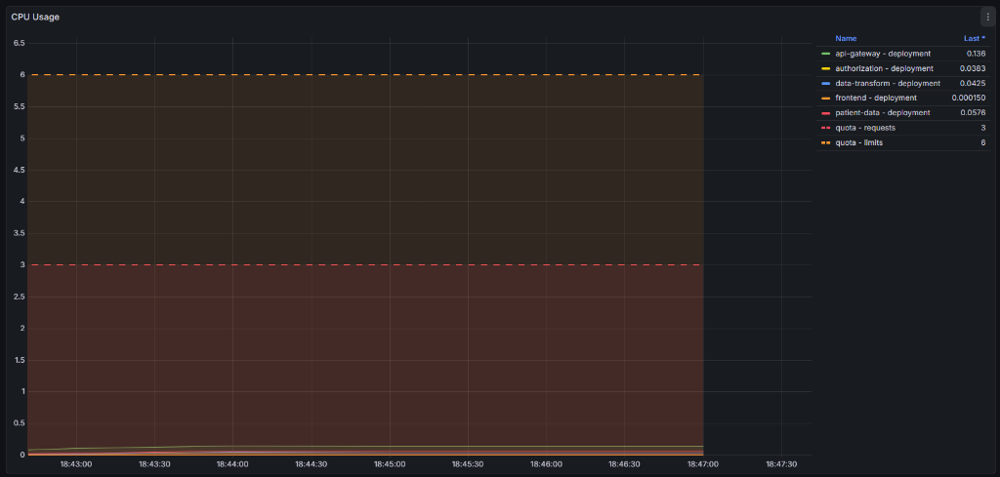
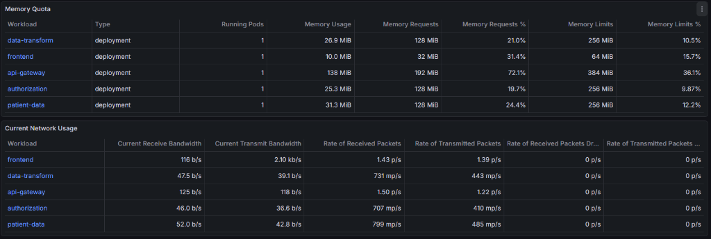
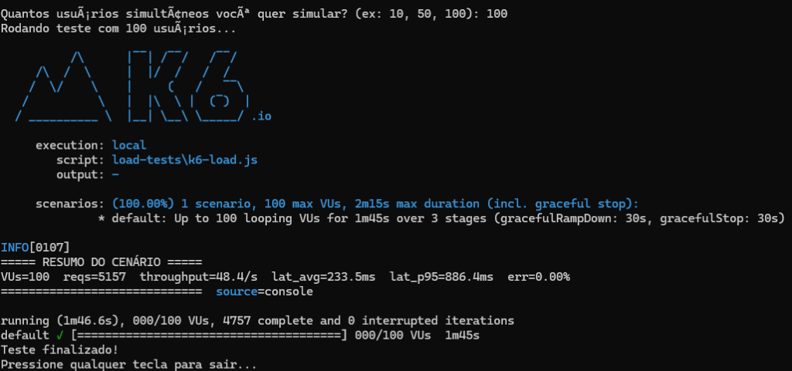

#### Cenário 2: Gargalo com 500 VUs (1 Réplica)
*Mostra o gargalo da arquitetura. Com apenas 1 réplica, o limite de requisições TCP é atingido e filas começam a se formar, elevando a latência para ~2200ms.*
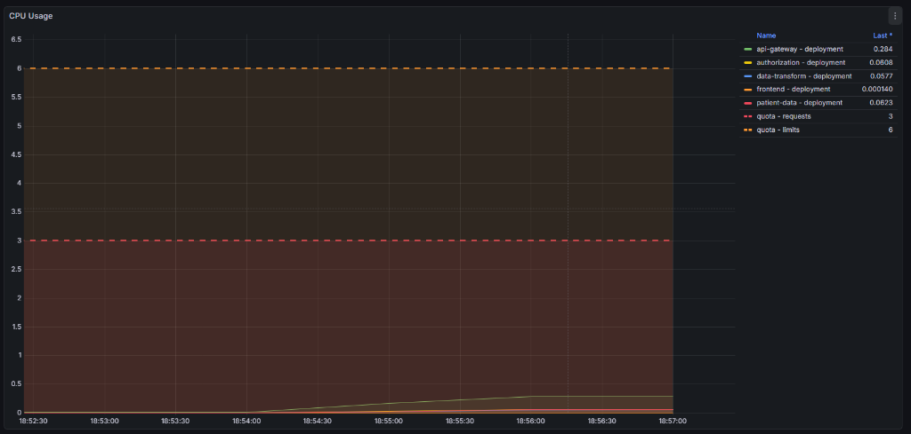
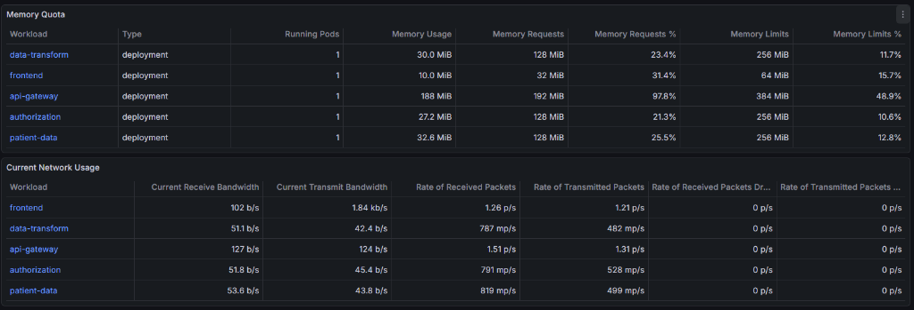
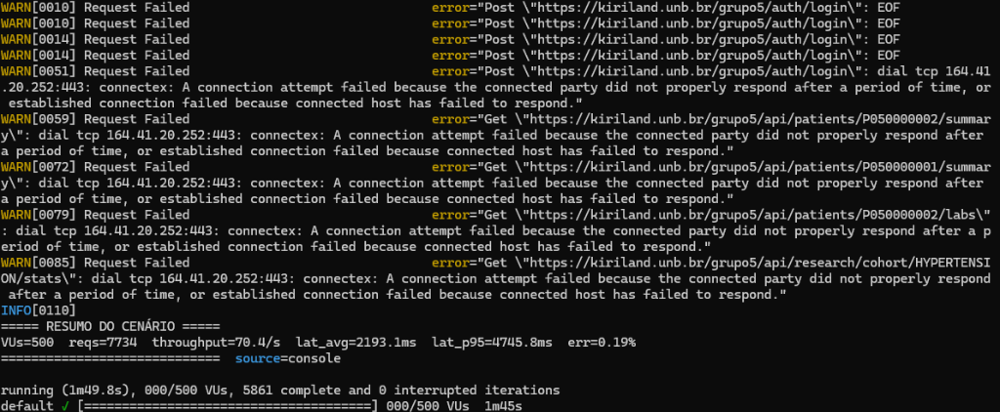

#### Cenário 3: Escalabilidade de Sucesso com 500 VUs (3 Réplicas)
*Mostra o poder do Kubernetes. Com 3 réplicas superando as restrições da cota (reduzimos os limites de CPU), a latência despenca pela metade (~1200ms) e o throughput aumenta.*
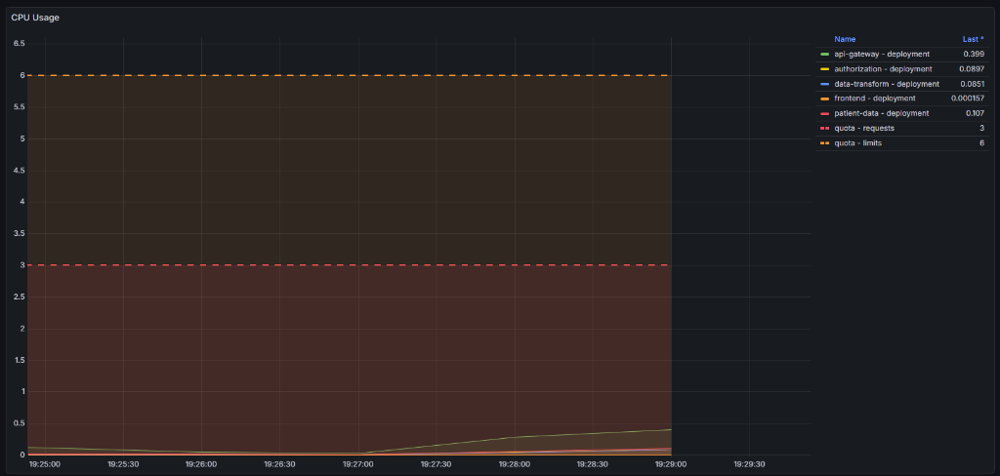
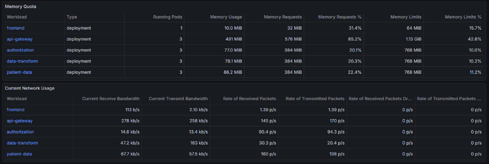
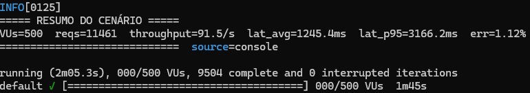

#### Cenário 4: Colapso por Limite de Infraestrutura com 1000 VUs (1 Réplica)
*Mostra a arquitetura monótona cedendo à pressão. A latência sobe para níveis exorbitantes (>10.000ms de p95) e o gateway recusa 80% das conexões por Timeout de Socket TCP.*
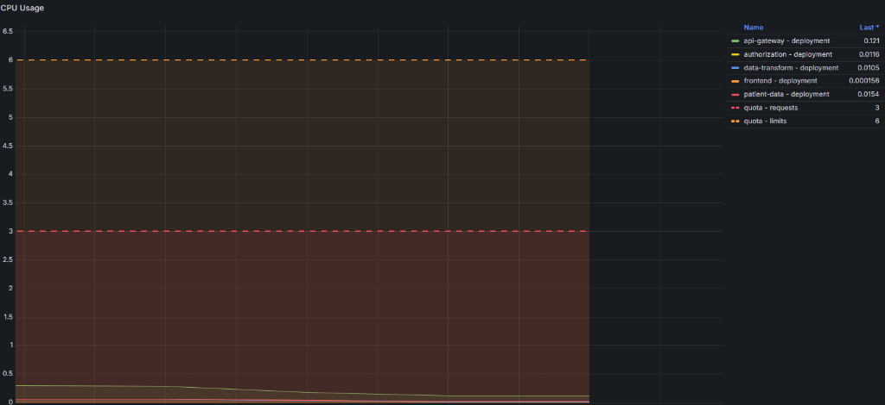
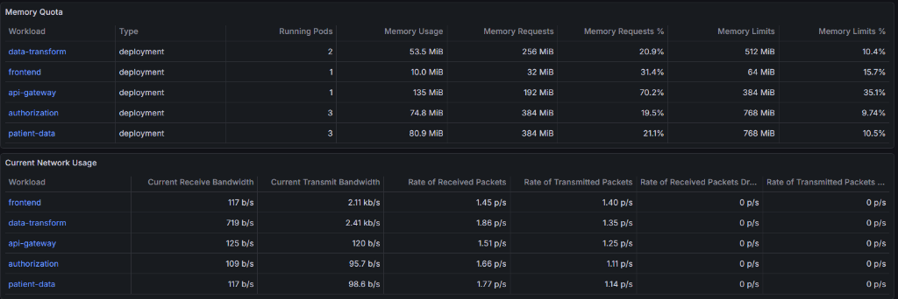
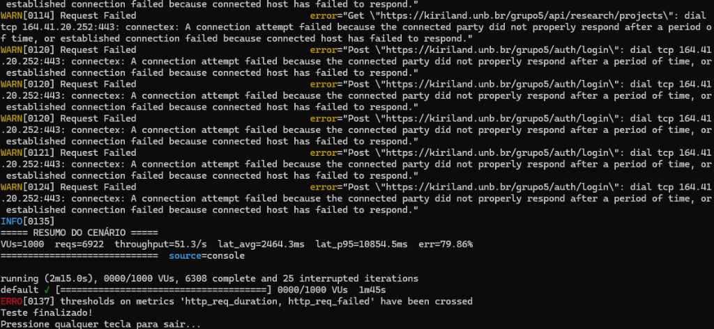

#### Cenário 5: Saturação de Cota e Rede com 1000 VUs (3 Réplicas)
*Mostra o limite físico ("Teto") do experimento. Mesmo com 3 réplicas operando, o volume de conexões síncronas derruba os sockets TCP e os contêineres entram em CPU Throttling devido à cota de limites estreita que foi configurada.*
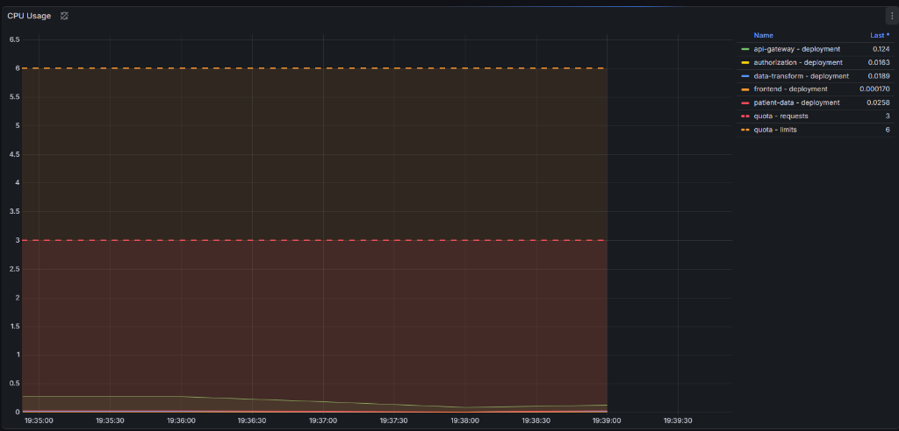
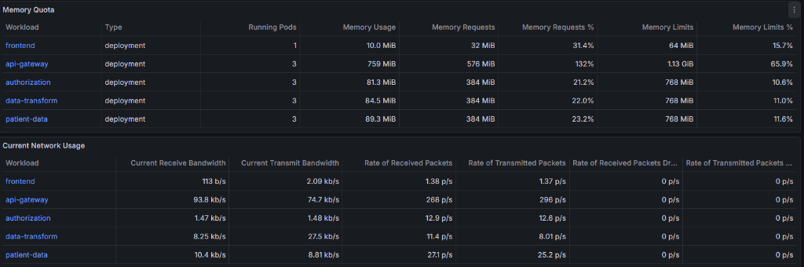
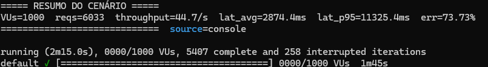
---

## 4. Conclusões Individuais e Autoavaliação

*Esta seção reflete as impressões pessoais, conhecimentos adquiridos e autoavaliação de cada membro da equipe perante os desafios do projeto.*

### Vinicius Alves
* **Pesquisa e trabalho:** Responsável pela operação e execução da infraestrutura. Adaptei os manifestos Kubernetes (`Deployment`, `Secrets`, `HPA` e Ingress), contornei as restrições de ResourceQuotas do *cluster* reduzindo os limites de CPU, e fui o responsável por idealizar e executar toda a bateria de testes de carga e estresse utilizando o k6 e a análise pelo Grafana. Além disso, identifiquei gargalos reais de rede (conexões TCP no API Gateway) e fui responsável por debugar e corrigir a imagem Docker do microsserviço de *patient-data* perante falhas que surgiram durante o escalonamento.
* **Aprendizados:** Aprendi na prática que escalar sistemas distribuídos não é apenas uma questão de "aumentar réplicas". O projeto me ensinou a importância do monitoramento contínuo: vi em tempo real como o limite de CPU estrangula contêineres (*throttling*), como portas TCP se esgotam em picos de 1000 conexões e como a observabilidade (Prometheus/Grafana) é a única luz no fim do túnel para descobrir por que a latência de uma API saltou de 200ms para 3000ms.
* **Nota de autoavaliação:** 9

### Fábio
* **Pesquisa e trabalho:** *(Inserir texto)*
* **Aprendizados:** *(Inserir texto)*
* **Nota de autoavaliação:** *(Inserir nota)*

### Lucas Meireles
* **Pesquisa e trabalho:** *(Inserir texto)*
* **Aprendizados:** *(Inserir texto)*
* **Nota de autoavaliação:** *(Inserir nota)*

### Pedro Haick
* **Pesquisa e trabalho:** *(Inserir texto)*
* **Aprendizados:** *(Inserir texto)*
* **Nota de autoavaliação:** *(Inserir nota)*

---
## 5. Referências
* Kubernetes Documentation. Disponível em: https://kubernetes.io/docs/home/
* k6 Documentation. Disponível em: https://k6.io/docs/
* Prometheus. Disponível em: https://prometheus.io/docs/introduction/overview/
* Arundel, J. and Domingus, J. *Cloud Native DevOps with Kubernetes – Building, Deploying and Scaling Modern Applications in the Cloud*, O’Reilly, 2019.
